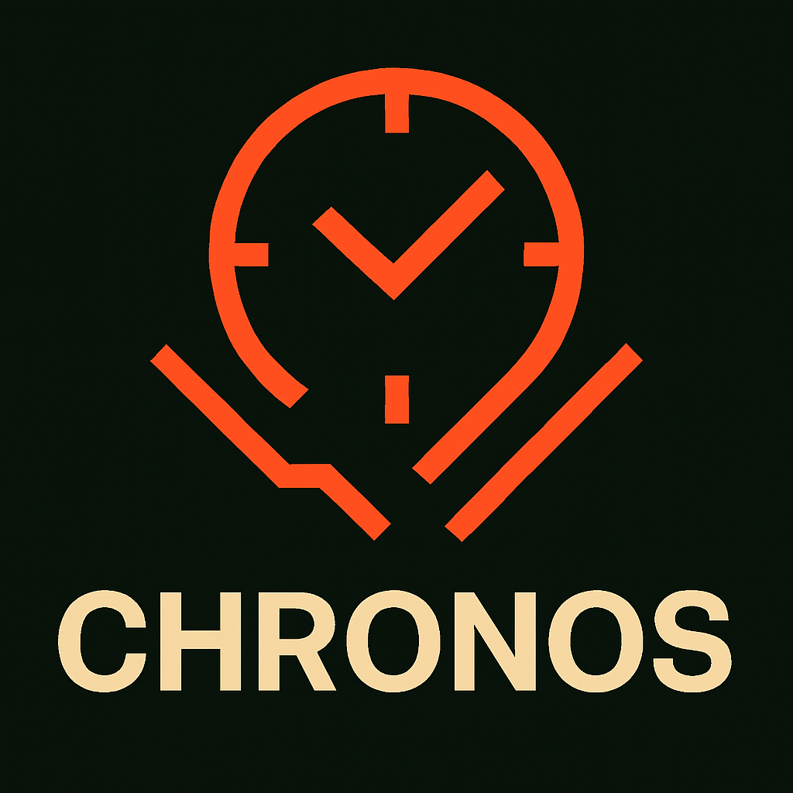

# Chronos 

A lightweight, asynchronous logging library for Go. Chronos writes colorized console output and rotates log files based on a configurable period (hour/day/week/month/year). It is initialized with a simple configuration and exposes convenience helpers for each level.

- Author: Mark Oxley
- Company: DaggerTech
- Module: `github.com/markoxley/chronos`

## Features

- Asynchronous, buffered file writes
- Colorized console output
- Log rotation by hour/day/week/month/year
- Minimal API with formatted variants
- Sensible OS-specific defaults if not provided

## Installation

```bash
go get github.com/markoxley/chronos
```

## Quick Start

```go
package main

import (
    "log"
    "github.com/markoxley/chronos"
)

func main() {
    cfg := &chronos.Config{
        AppName:    "nexus",
        // If omitted, Location defaults to /var/log/<AppName> (Linux/macOS)
        // or C:\\ProgramData\\<AppName>\\logs (Windows)
        Location:   "/var/log/nexus",
        FilePeriod: chronos.LogPeriodDay,  // Hour, Day, Week, Month, Year
        Level:      chronos.INFO,          // DEBUG, INFO, WARN, ERROR, FATAL
    }

    if err := chronos.Init(cfg); err != nil {
        log.Fatal(err)
    }

    chronos.Info("service started")
    chronos.Warnf("cache warm took %dms", 123)
    chronos.Debug("debug details")

    // ... your app ...

    chronos.Stop() // gracefully flush and close
}
```

## Configuration

Defined in `config.go` as:

- `AppName` string: Used to derive a default OS-specific log directory when `Location` is empty.
- `Location` string: Absolute directory where log files are written. Created with 0755 if missing.
- `FilePeriod` LogPeriod: Determines rotation cadence and filename format.
- `Level` string: Minimum level to emit (DEBUG, INFO, WARN, ERROR, FATAL).
- `AutoStop` bool: When true, Chronos installs an OS signal handler (SIGINT/SIGTERM) to call `Stop()` automatically for graceful shutdown.

### LogPeriod values (see `logperiod.go`)

- `LogPeriodHour`  -> `nexus_YYYY-MM-DDTHH.log`
- `LogPeriodDay`   -> `nexus_YYYY-MM-DD.log`
- `LogPeriodWeek`  -> `nexus_YYYY-WW.log` (ISO week)
- `LogPeriodMonth` -> `nexus_YYYY-MM.log`
- `LogPeriodYear`  -> `nexus_YYYY.log`

### Levels (see `levels.go`)

- `DEBUG`, `INFO`, `WARN`, `ERROR`, `FATAL`

## Filenames and Rotation

Chronos derives filenames via `(*Logging).filename(t time.Time)` based on `Config.FilePeriod`. Weekly rotation uses ISO 8601 week numbering via `time.Time.ISOWeek()`.

## Windows vs Linux defaults

If `Location` is empty, `Init()` sets:
- Windows: `C:\\ProgramData\\<AppName>\\logs`
- Linux/macOS: `/var/log/<AppName>`

Ensure your process has permissions to create/write in the directory.

## Custom Handlers

You can register a custom handler that will be invoked whenever a log message is processed. This is useful for forwarding logs to external services, metrics systems, or performing additional real-time processing.

```go
chronos.SetHandler(func(ts time.Time, level string, message string) {
    // Perform custom logic here
    fmt.Printf("Intercepted log: [%s] %s: %s\n", ts.Format(time.RFC3339), level, message)
})
```

## API Overview

- `Init(cfg *Config) error`: Initialize global logger and start background writer.
- `Stop()`: Gracefully closes channel and releases the global logger. Thread-safe.
- `SetHandler(handler func(time.Time, string, string))`: Register a custom callback for each log entry.
- Logging helpers:
  - `Info(msg string)`, `Warn(msg string)`, `Error(msg string)`, `Debug(msg string)`, `Fatal(msg string)`
  - `Infof(fmt string, ...)`, `Warnf(fmt string, ...)`, `Errorf(fmt string, ...)`, `Debugf(fmt string, ...)`, `Fatalf(fmt string, ...)`

## Examples

### Default location (derived from AppName)
```go
cfg := &chronos.Config{ AppName: "nexus", FilePeriod: chronos.LogPeriodHour, Level: chronos.INFO }
if err := chronos.Init(cfg); err != nil { /* handle */ }
chronos.Info("hello world")
```

### Per-week rotation
```go
cfg := &chronos.Config{ AppName: "nexus", Location: "/var/log/nexus", FilePeriod: chronos.LogPeriodWeek, Level: chronos.WARN }
_ = chronos.Init(cfg)
chronos.Warn("will appear")
chronos.Info("will NOT appear (threshold=WARN)")
```

### Windows example
```go
cfg := &chronos.Config{ AppName: "nexus", Location: "C:\\ProgramData\\Nexus\\logs", FilePeriod: chronos.LogPeriodDay, Level: chronos.DEBUG }
_ = chronos.Init(cfg)
chronos.Debugf("connected to %s", "db")
```

### Automatic graceful shutdown
Enable `AutoStop` to automatically flush and close on SIGINT/SIGTERM (e.g., Ctrl-C, container stop):
```go
cfg := &chronos.Config{
  AppName:    "nexus",
  FilePeriod: chronos.LogPeriodDay,
  Level:      chronos.INFO,
  AutoStop:   true, // installs signal handler to call Stop()
}
if err := chronos.Init(cfg); err != nil { /* handle */ }
// ... run app ...
// Optional: chronos.Stop() is still safe to call manually
```

### Using a custom handler
Intercept logs for external processing:
```go
chronos.SetHandler(func(ts time.Time, level string, message string) {
    if level == "ERROR" {
        sendSlackNotification(message)
    }
})
```

## Running tests and benchmarks

From the project root:
```bash
go test -v ./...
```

Run tests and benchmarks together (in VS Code you can set these flags in `go.testFlags`):
```bash
go test -v -run . -bench . -benchmem ./...
```

## Contributing

- Open issues/PRs with clear descriptions and reproduction steps.
- Ensure `go test ./...` passes.

## License

This project is licensed under the MIT License. See `LICENSE` for details.
